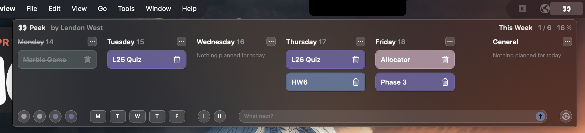

# 👀 Peek – Lightweight macOS Menu Bar Task Manager

## 🖥️ Overview

Peek is a minimalist macOS menu bar application designed to help users quickly jot down and manage tasks throughout the workweek. With just a click on the menu bar icon, users can add tasks, assign colored categories, and set importance levels, ensuring that essential to-dos are always within reach without disrupting workflow.  

## 🖼️ Screenshot



## 🎯 Project Objectives

- Develop a non-intrusive task management tool accessible from the macOS menu bar.
- Implement features to categorize tasks and assign priority levels.
- Enhance productivity by providing quick access to daily tasks.

## 🛠️ Technologies Used

- **Programming Language:** Swift
- **Platform:** macOS
- **Development Environment:** Xcode

## 🧠 Key Learnings

- **macOS Menu Bar Integration:** Gained experience in creating applications that reside in the macOS menu bar for easy accessibility.
- **User Interface Design:** Designed intuitive UI components that allow users to add and manage tasks efficiently.
- **State Management:** Implemented mechanisms to handle task data, including categories and importance levels.
- **User Experience Optimization:** Focused on creating a seamless experience that integrates smoothly into the user's daily workflow.

## 🚀 Getting Started

1. **Clone the repository:**

    ```bash
    git clone https://github.com/landonwest815/peek.git
    ```

2. **Open in Xcode:**
    - Navigate to `File` > `Open` and select the cloned repository folder.

3. **Build and Run:**
    - Select your target device (Mac).
    - Click the `Run` button to build and launch the application.

## 📌 Future Enhancements

- Introduce keyboard shortcuts for faster task management.
- Enable synchronization with calendar applications.
